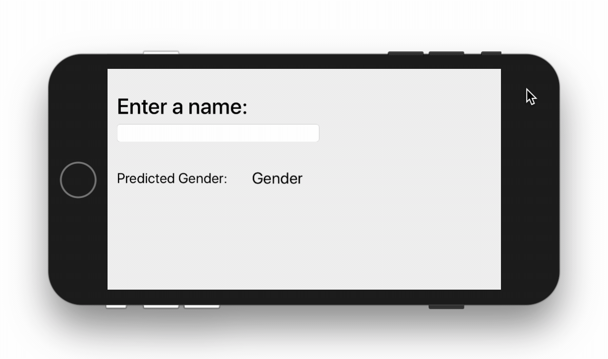
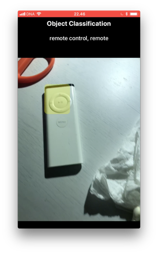
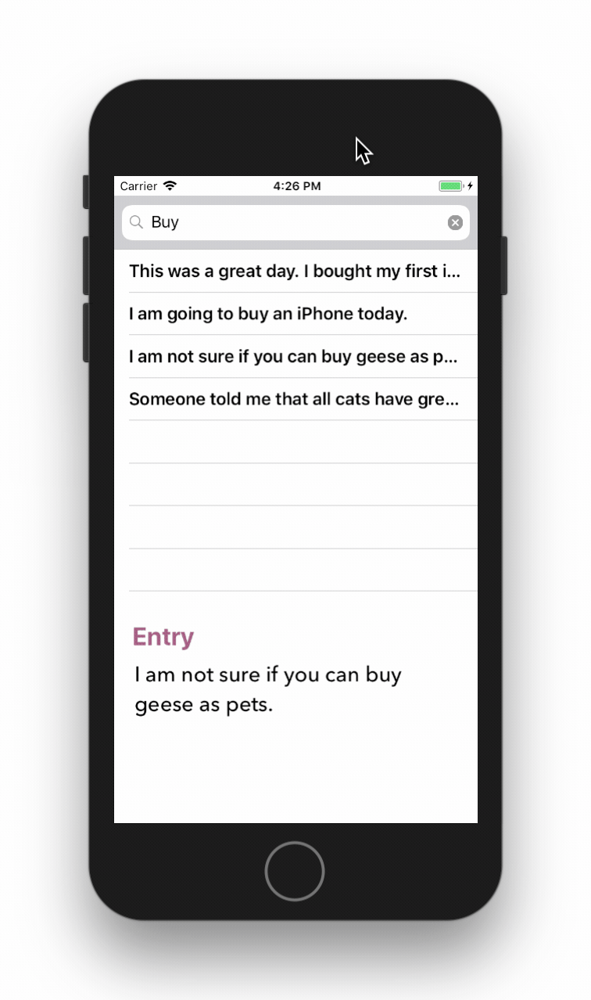

# CoreML iOS

### App: Predicting the gender based on the name

### How To: [Convert a model to CoreML format (.mlmodel)](https://gist.github.com/0be7b5d2d9aaec4de8431c4cb05dd45d)

[namesDataset.csv](https://gist.github.com/b477e5e479daab02ae1d003473242db4)

### App: Object classification from an iPhone

### App: Lemmatization using Neuro Linguistic Processing (NLP) filter

